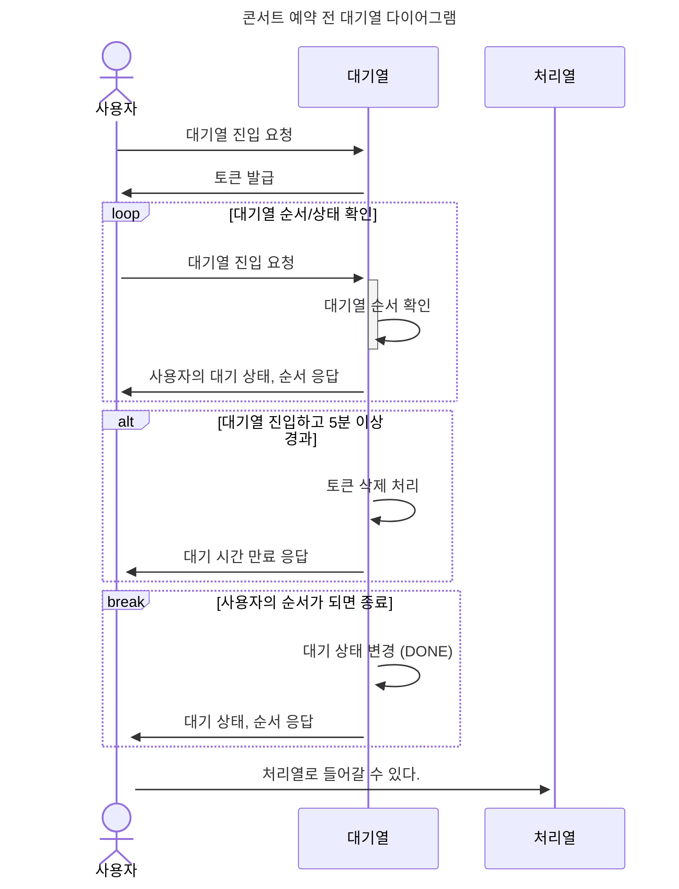
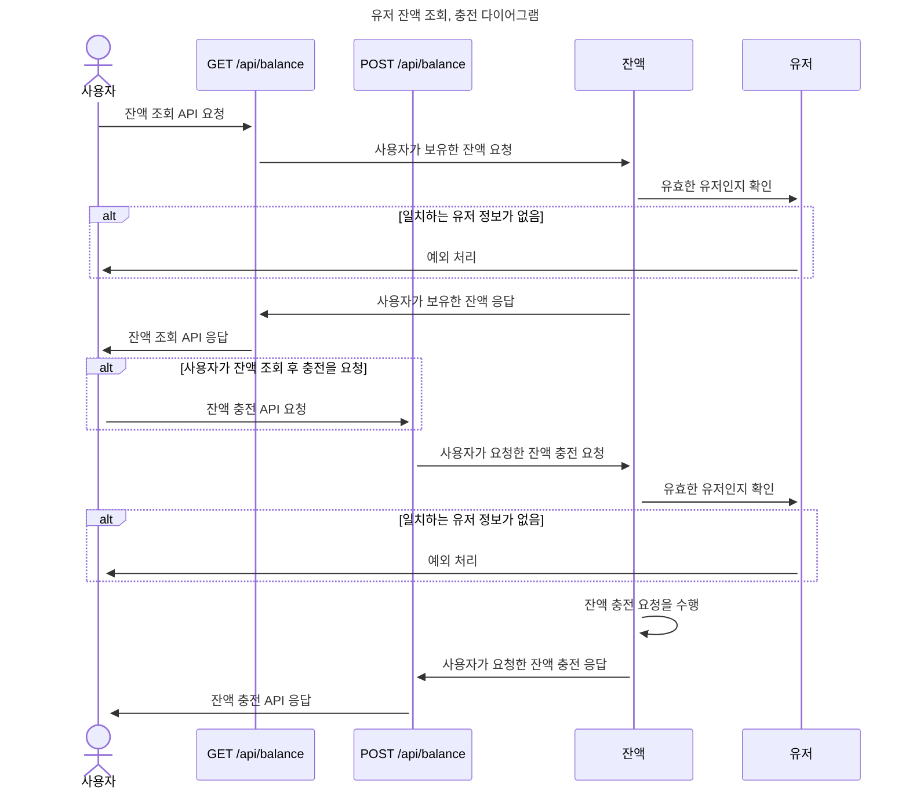
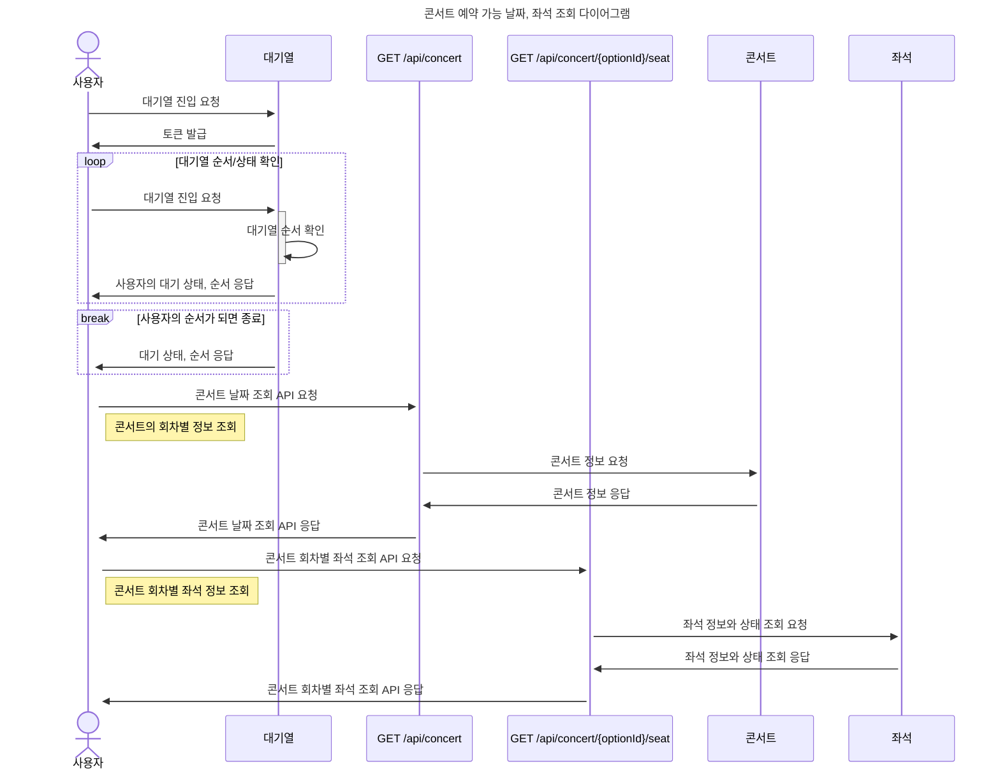
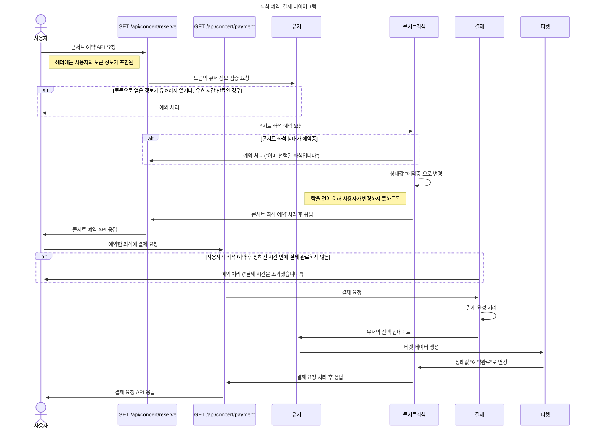

# hhplus_3rd_concert
항해플러스 3주차 과제 : 콘서트 예매 서버 구축

  

## 설계 문서

---

### 1. 마일스톤

  

### 2. 시퀀스 다이어그램

  

### ERD

  
### API 명세서
링크 🔗 https://grand-spoonbill-ff4.notion.site/API-8f64568b50ab4b159201d2a863838528?pvs=74

