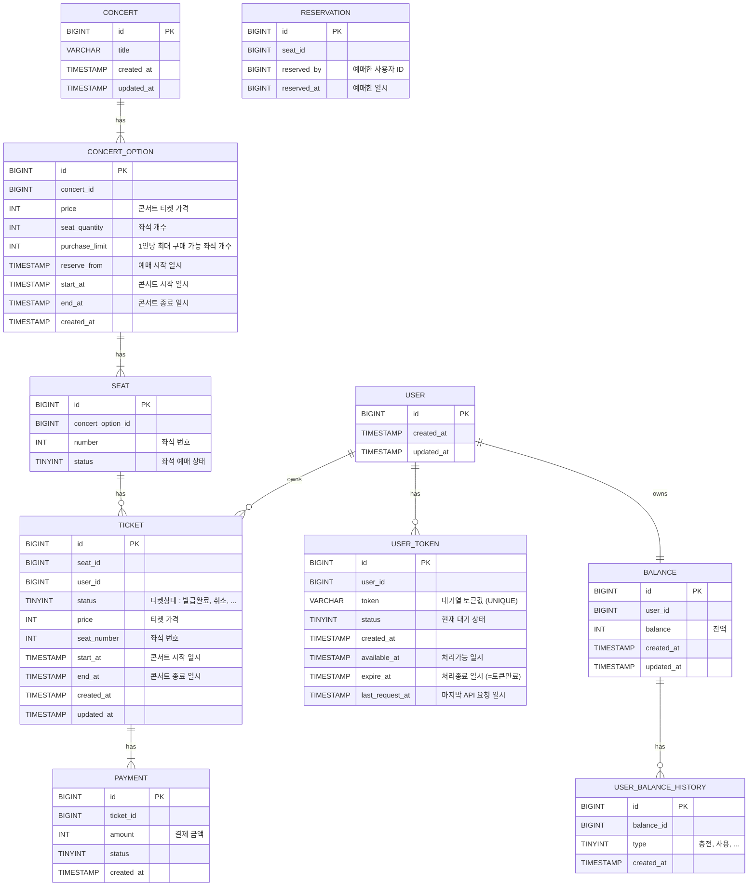

```mermaid
erDiagram
    USER {
        BIGINT id PK
        TIMESTAMP created_at
        TIMESTAMP updated_at
    }

    BALANCE {
        BIGINT id PK
        BIGINT user_id
        INT balance "잔액"
        TIMESTAMP created_at
        TIMESTAMP updated_at
    }

    USER_BALANCE_HISTORY {
        BIGINT id PK
        BIGINT balance_id
        TINYINT type "충전, 사용, ..."
        TIMESTAMP created_at
    }

    USER_TOKEN {
        BIGINT id PK
        BIGINT user_id
        VARCHAR token "대기열 토큰값 (UNIQUE)"
        TINYINT status "현재 대기 상태"
        TIMESTAMP created_at
        TIMESTAMP available_at "처리가능 일시"
        TIMESTAMP expire_at "처리종료 일시 (=토큰만료)"
        TIMESTAMP last_request_at "마지막 API 요청 일시"
    }

    CONCERT {
        BIGINT id PK
        VARCHAR title
        TIMESTAMP created_at
        TIMESTAMP updated_at
    }

    CONCERT_OPTION {
        BIGINT id PK
        BIGINT concert_id
        INT price "콘서트 티켓 가격"
        INT seat_quantity "좌석 개수"
        INT purchase_limit "1인당 최대 구매 가능 좌석 개수"
        TIMESTAMP reserve_from "예매 시작 일시"
        TIMESTAMP start_at "콘서트 시작 일시"
        TIMESTAMP end_at "콘서트 종료 일시"
        TIMESTAMP created_at
    }

    SEAT {
        BIGINT id PK
        BIGINT concert_option_id
        INT number "좌석 번호"
        TINYINT status "좌석 예매 상태"
    }

%% 이선좌인 경우에만 조회할 테이블
%% 5분 초과 시 예매 취소
    RESERVATION {
        BIGINT id PK
        BIGINT seat_id
        BIGINT reserved_by "예매한 사용자 ID"
        BIGINT reserved_at "예매한 일시"
    }

%% 결제까지 완료되어야 생성됨
%% 예약(이선좌) 관리는 status 컬럼으로 관리 => 낙관적 락
    TICKET {
        BIGINT id PK
        BIGINT seat_id
        BIGINT user_id
        TINYINT status "티켓상태 : 발급완료, 취소, ..."
        INT price "티켓 가격"
        INT seat_number "좌석 번호"
        TIMESTAMP start_at "콘서트 시작 일시"
        TIMESTAMP end_at "콘서트 종료 일시"
        TIMESTAMP created_at
        TIMESTAMP updated_at
    }

    PAYMENT {
        BIGINT id PK
        BIGINT ticket_id
        INT amount "결제 금액"
        TINYINT status
        TIMESTAMP created_at
    }

    USER ||--|| BALANCE: "owns"
    BALANCE ||--o{ USER_BALANCE_HISTORY: "has"
    USER ||--o{ USER_TOKEN: "has"
    CONCERT ||--|{ CONCERT_OPTION: "has"
    CONCERT_OPTION ||--|{ SEAT: "has"
    SEAT ||--o{ TICKET: "has"
    USER ||--o{ TICKET: "owns"
    TICKET ||--|{ PAYMENT: "has"
```