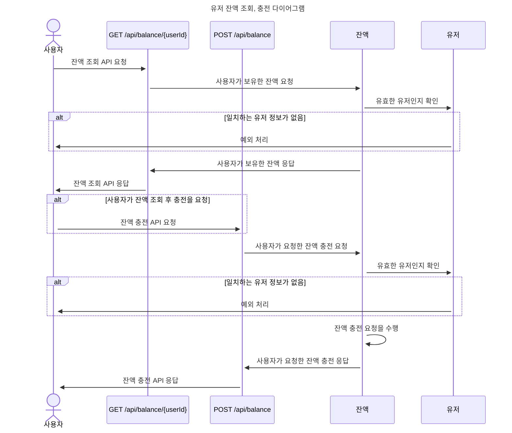

## 유저 잔액 조회, 충전 다이어그램

---

- 사용자는 보유한 잔액을 조회합니다. 
- 보유 잔액을 조회 후 잔액 충전을 요청할 수 있습니다. 
- 단, 잔액 조회와 충전은 대기열을 기다릴 필요가 없습니다.

  

```mermaid
sequenceDiagram
    title 유저 잔액 조회, 충전 다이어그램
    actor 사용자
    participant getapi as GET /api/balance/{userId}
    participant postapi as POST /api/balance
    participant 잔액
    participant 유저

    사용자 ->>+ getapi : 잔액 조회 API 요청
    
    getapi ->>+ 잔액 : 사용자가 보유한 잔액 요청
    
    잔액 ->>+ 유저 : 유효한 유저인지 확인
    alt 일치하는 유저 정보가 없음
        유저 ->>+ 사용자 : 예외 처리
    end
    
    잔액 ->>+ getapi : 사용자가 보유한 잔액 응답

    getapi ->>+ 사용자 : 잔액 조회 API 응답
    
    alt 사용자가 잔액 조회 후 충전을 요청
        사용자 ->>+ postapi : 잔액 충전 API 요청
    end
    
    postapi ->>+ 잔액 : 사용자가 요청한 잔액 충전 요청

    잔액 ->>+ 유저 : 유효한 유저인지 확인
    alt 일치하는 유저 정보가 없음
        유저 ->>+ 사용자 : 예외 처리
    end
    
    잔액 ->>+ 잔액 : 잔액 충전 요청을 수행
    
    잔액 ->>+ postapi : 사용자가 요청한 잔액 충전 응답
    
    postapi ->>+ 사용자 : 잔액 충전 API 응답

```