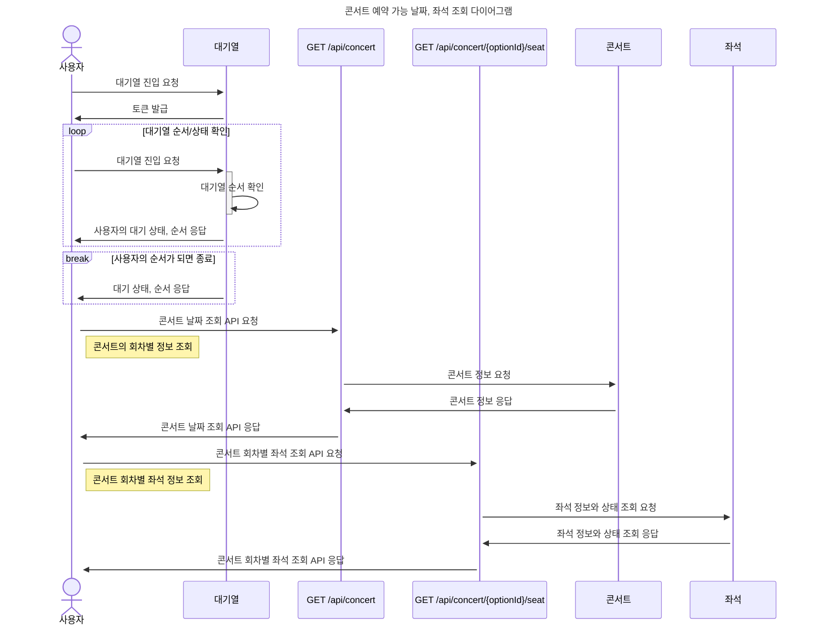

## 콘서트 예약 가능 날짜, 좌석 조회 다이어그램

---

- 사용자는 토큰 발급 후 대기열을 기다립니다. 
- 순서가 되면 예약 가능한 콘서트 정보 조회, 예약 가능한 좌석 조회를 차례대로 요청합니다.

  

```mermaid
sequenceDiagram
    title 콘서트 예약 가능 날짜, 좌석 조회 다이어그램
    actor 사용자
    participant 대기열
    participant concertapi as GET /api/concert
    participant seatapi as GET /api/concert/{optionId}/seat
    participant 콘서트
    participant 좌석
    
    사용자 ->>+ 대기열 : 대기열 진입 요청

    대기열 ->>+ 사용자 : 토큰 발급
    
    loop 대기열 순서/상태 확인
        사용자 ->>+ 대기열 : 대기열 진입 요청
        대기열 ->>- 대기열 : 대기열 순서 확인
        대기열 ->>+ 사용자 : 사용자의 대기 상태, 순서 응답
    end
    break 사용자의 순서가 되면 종료
        대기열 ->>+ 사용자 : 대기 상태, 순서 응답
    end

    사용자 ->>+ concertapi : 콘서트 날짜 조회 API 요청
    note right of 사용자 : 콘서트의 회차별 정보 조회

    concertapi ->>+ 콘서트 : 콘서트 정보 요청

    콘서트 ->>+ concertapi : 콘서트 정보 응답

    concertapi ->>+ 사용자 : 콘서트 날짜 조회 API 응답
    
    사용자 ->>+ seatapi : 콘서트 회차별 좌석 조회 API 요청
    note right of 사용자 : 콘서트 회차별 좌석 정보 조회
    
    seatapi ->>+ 좌석 : 좌석 정보와 상태 조회 요청
    
    좌석 ->>+ seatapi : 좌석 정보와 상태 조회 응답
    
    seatapi ->>+ 사용자 : 콘서트 회차별 좌석 조회 API 응답
    
```