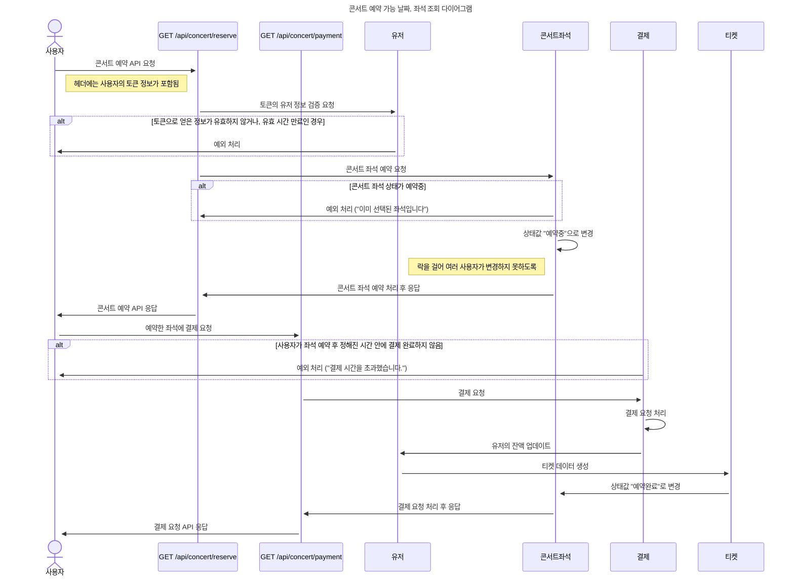

## 좌석 예약, 결제 다이어그램

---

- 대기열에 들어온 사용자는 콘서트 회차별 좌석을 1개 이상 예매할 수 있습니다.
- 좌석 예약과 동시에 해당 좌석은 그 유저에게 약 (예시 : 5분)간 임시 배정됩니다.
    임시배정된 상태라면 다른 사용자는 예약할 수 없어야 합니다.
- 만약 배정 시간 내에 결제가 완료되지 않는다면 좌석에 대한 임시 배정은 해제되어야 합니다.
- 예약 요청이 성공적으로 이루어지면, 결제 API를 요청합니다.
- 결제가 완료되면 해당 좌석의 소유권(티켓)을 유저에게 배정하고 대기열 토큰을 만료시킵니다.

  

