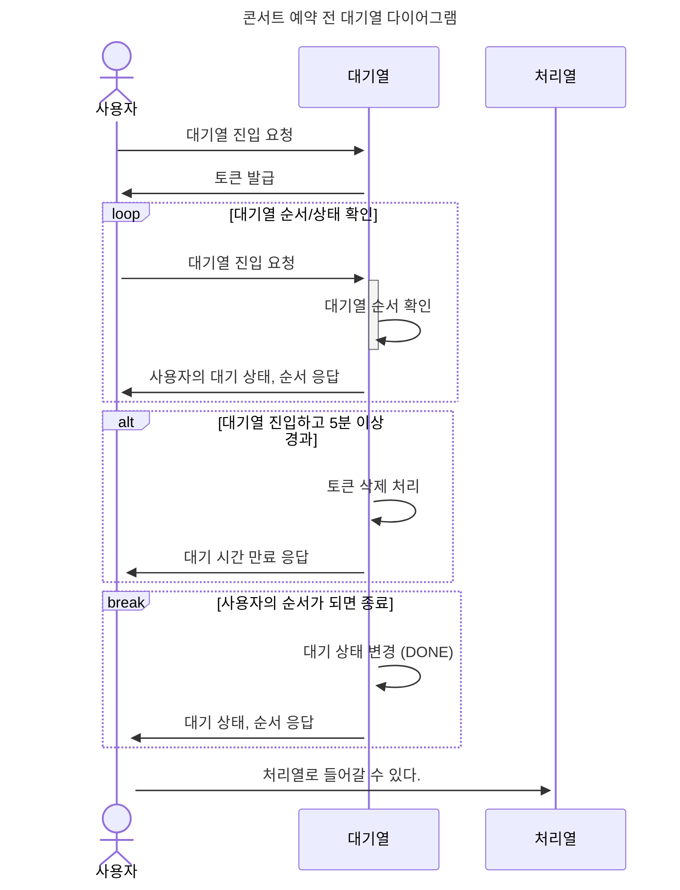

## 콘서트 예약 전 대기열 다이어그램

---

- 사용자는 토큰 발급 후 대기열을 기다립니다.
- 순서가 되면 콘서트 관련 API를 요청할 수 있습니다.

  

```mermaid
sequenceDiagram
    title 콘서트 예약 전 대기열 다이어그램
    actor 사용자
    participant 대기열
    participant 처리열
        
    사용자 ->>+ 대기열 : 대기열 진입 요청

    대기열 ->>+ 사용자 : 토큰 발급
    
    loop 대기열 순서/상태 확인
        사용자 ->>+ 대기열 : 대기열 진입 요청
        대기열 ->>- 대기열 : 대기열 순서 확인
        대기열 ->>+ 사용자 : 사용자의 대기 상태, 순서 응답
    end
    
    alt 대기열 진입하고 5분 이상 경과
        대기열 ->>+ 대기열 : 토큰 삭제 처리
        대기열 ->>+ 사용자 : 대기 시간 만료 응답 
    end
    
    break 사용자의 순서가 되면 종료
        대기열 ->>+ 대기열 : 대기 상태 변경 (DONE)
        대기열 ->>+ 사용자 : 대기 상태, 순서 응답
    end

    사용자 ->>+ 처리열 : 처리열로 들어갈 수 있다.
    
```